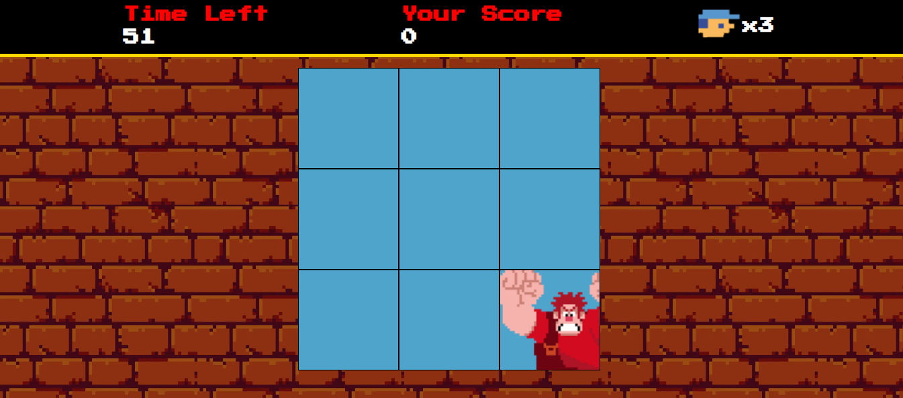

# Detona Ralph
Projeto de um jogo do Detona Ralph inspirado no estilo de **Acerte a Marmota**. O projeto foi feito usando **HTML**, **CSS** e **JavaScript**.

## Tecnologias usadas
- HTML
- CSS
- JavaScript

## Como funciona?
O funcionamento é simples: você deve clicar no quadrado onde o Ralph aparece a cada momento. Seu objetivo é acumular o máximo de pontos possível antes que o tempo acabe. No entanto, se você clicar em um quadrado onde o Ralph não está, perderá uma vida, e você começa com três.

Então, bom jogo e se divirta! 🏆

## Mais sobre o projeto
O projeto foi realizado pela [DIO](https://github.com/digitalinnovationone) e acompanhei etapa por etapa para o desenvolvimento do projeto.

O diferencial do meu projeto em relação ao da **DIO** é a implementação de um sistema que responde de forma eficaz quando o jogador clica no quadrado errado, perdendo uma vida por erro. Ao perder todas as vidas ou quando o tempo se esgota, um modal (pop-up) aparece, informando a pontuação final do jogador.
